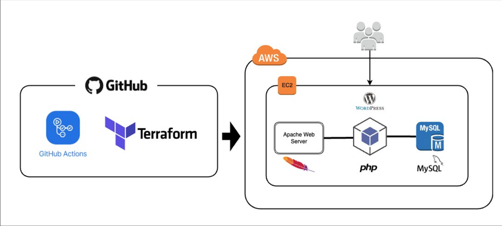

# Project Title

Terraform EC2 and WordPress Provisioning

## Description

This project demonstrates the use of Terraform to provision an EC2 instance and deploy WordPress on it using user data scripts. Additionally, it utilizes Amazon S3 to store the Terraform state (note: state locking is not implemented in this project). GitHub Actions workflows are also used to apply and destroy the Terraform configuration, which can be triggered manually.

## Architecture



## Prerequisites

- Terraform installed
- AWS CLI configured with appropriate permissions
- An S3 bucket created for storing the Terraform state

## Usage

1. Clone the repository:
    ```sh
    git clone https://github.com/chetanchandane/terraform-wordpress.git 
    cd terraform-wordpress
    ```

2. Initialize Terraform:
    ```sh
    terraform init
    ```

3. Apply the Terraform configuration:
    ```sh
    terraform apply
    ```

4. Follow the prompts to confirm the deployment.

## Files

- `main.tf`: Contains the main Terraform configuration for provisioning the EC2 instance and setting up WordPress.
- `variables.tf`: Defines the variables used in the Terraform configuration.
- `outputs.tf`: Specifies the outputs of the Terraform configuration.
- `wp_install.sh`: Script to install and configure WordPress on the EC2 instance.

## Notes

- Ensure that the S3 bucket specified in the Terraform backend configuration exists.
- State locking is not implemented in this project, so be cautious when running concurrent Terraform operations.

## License

This project is licensed under the MIT License.

## Acknowledgements

- Terraform documentation
- AWS documentation
